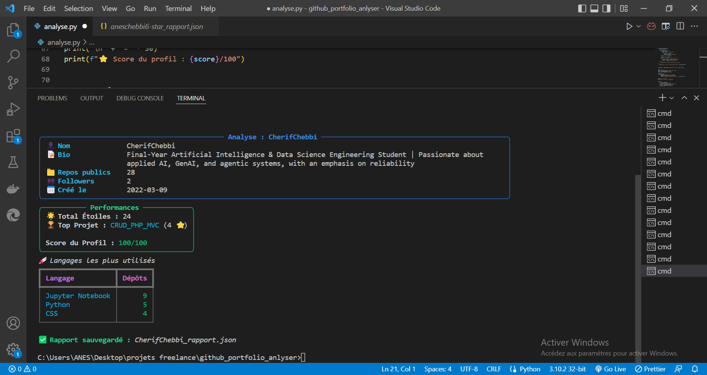

# 🔍 GitHub Profile Analyzer

A CLI tool that analyzes any GitHub profile using the GitHub API.

## ✨ Features
- 👤 Display profile info (name, followers, repos)
- 📁 List all public repositories
- 🏆 Top 3 most used languages
- ⭐ Most starred repository
- 📊 Profile score out of 100
- 💾 Export report as JSON file

## 🚀 Installation

git clone https://github.com/aneschebbi6-star/github_analyzer
cd github_analyzer
pip install requests rich

## 💻 Usage

python analyse.py

Enter any GitHub username when prompted.

## 📸 Example Output

Entrer le nom d'utilisateur github : CherifChebbi

## 🛠 Tech Stack
- Python 3.12
- requests
- Rich
- GitHub REST API

## 👨‍💻 Author
Anes chebbi
